# RASP-Bypass Benchmark

## bypass1 - jni

### System.load

Attack RASP based JAVA.

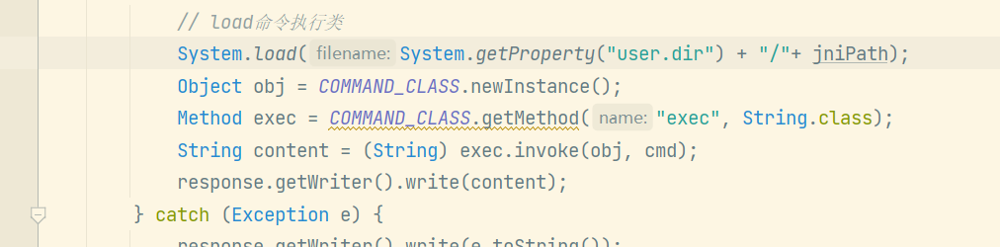

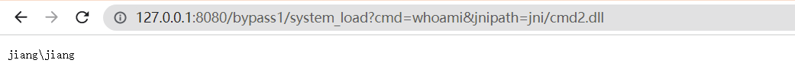

### ClassLoader.loadLibrary0

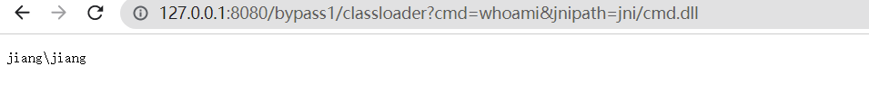

### tomcat-jni

开启时需要指定 

`-Djava.library.path=./jni/`

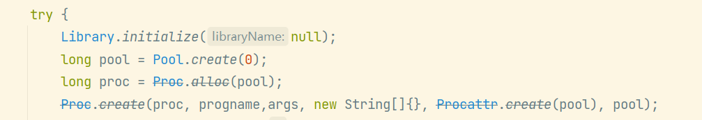

## bypass2  - 混淆的类名

### gozila

混淆类名

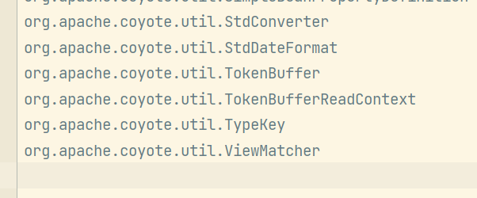

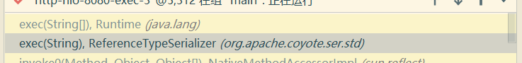

### behinder

## bypass3 - new thread

注入新线程 让rasp失去上下文信息从而绕过rasp检查。

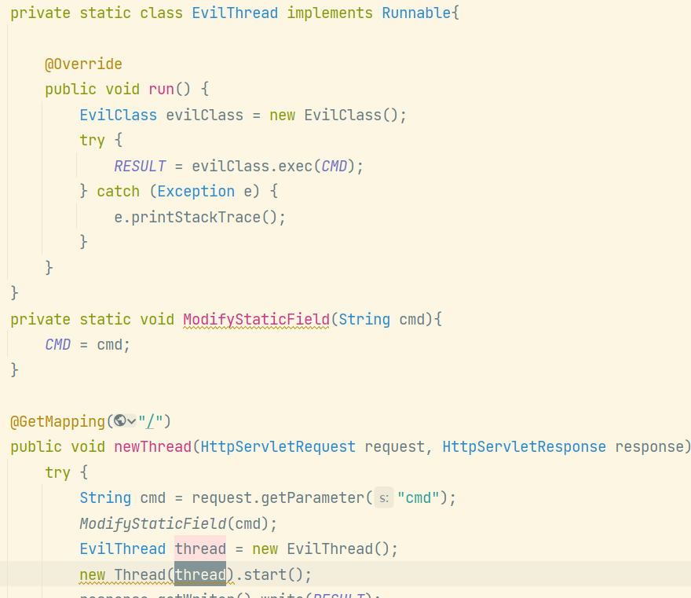

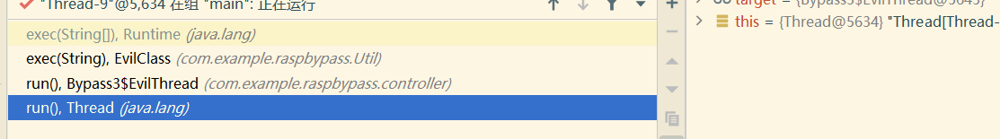

## bypass4 - Bootstrap Classloader

BootStrap Classloader 负责加载JVM（Java核心类库），且程序尝试获取BootStrap Classloader 会返回NULL

可以使用Bootstrap Classloader 规避 内存马的检测（部分RASP存在内存马检测功能）。

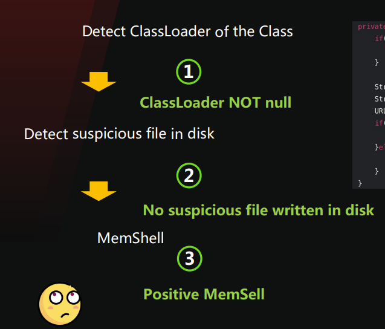

反射`java.lang.instrument.Instrumentation#appendToBootstrapClassLoaderSearch`

来将Jar 加入到 BootStrap ClassPath  下。

可以构造一个恶意的Jar包，或者利用文件上传，任意文件写入漏洞覆盖 charsets.jar

获取 Instrumentation 对象的方法如下:

- Attach：可以加载自己的 agent，在 premain 或 agentmain 方法中可以拿到
- 通过伪造 JPLISAgent 结构和反射调用 InstrumentationImpl 的 appendToBootstrapClassLoaderSearch 方法

## bypass5 - unsafe

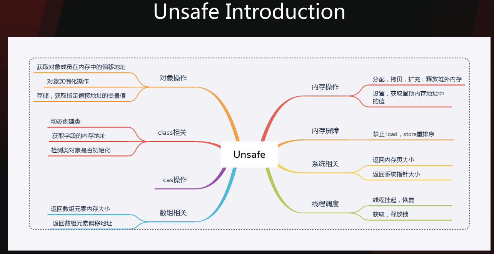

使用Unsafe 无需构造器实例化对象，然后执行 Native 方法绕过 RASP检测。

基于 Instrument 的JavaAgent 只能hook JVM的Class 而无法 操作Native 方法。

执行 UnixProcess 的 forkAndExec 方法绕过（仅限 Unix 系统，Win下没有这个类，Win下可以使用ProcessImpl，但是没必要使用Unsafe）

## bypass6 - 绕过黑名单

命令执行时可能会检测恶意的命令，比如 /bin/bash。

将 /bin/bash 复制到 /tmp/foobar

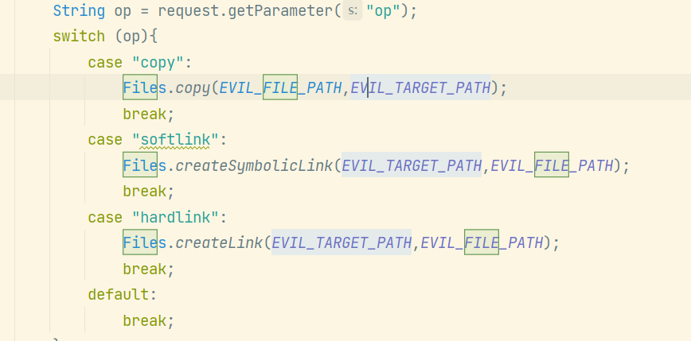

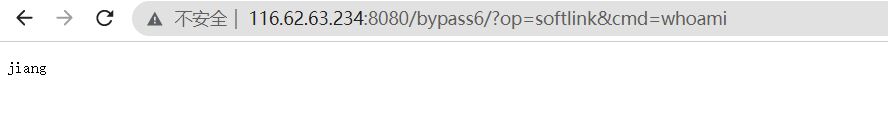

## bypass7 - WeakReference GC

利用弱引用GC（GC 也是在新线程中完成的，应该也会失去部分上下文信息。)

## bypass8 - Win ShellCode

利用sun.tools.attach.WindowsVirtualMachine 远程线程注入执行ShellCode

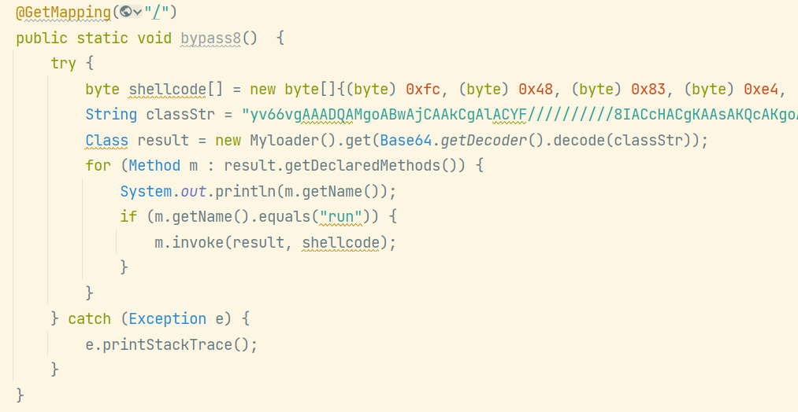
